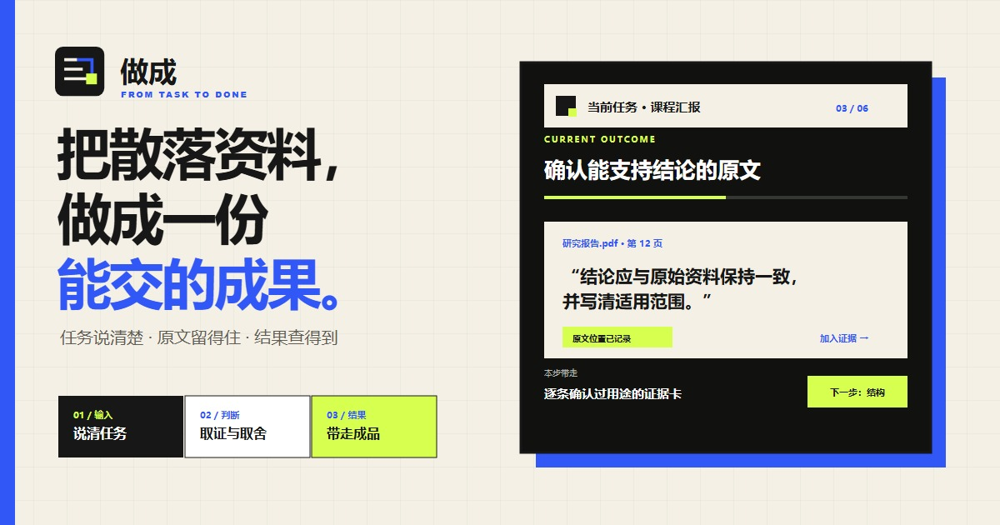

# 做成■



小林明早要做课程汇报。桌面上有一份 PDF、老师发来的 PPT、两页笔记，还有一句模糊要求：“讲清楚，别太长。”他不是不会写，而是不知道哪些话有证据、哪种结构更稳、今晚该先做什么。

他把材料放进做成■，先核对解析结果，再从原文建立证据卡。比较两种结构后，他选定一条，逐页改完初稿，最后导出能真实打开的 PPTX 和来源索引。原本散在桌面的材料，变成了一份可以按时提交、也经得起追问的文件。

*小林是用来说明产品的虚构人物；材料解析、证据卡、方案比较、核验和文件导出都是仓库中已经实现的功能。*

做成■ 服务大学生、研究生和刚进入职场的人。公开站讲方法，学生工作台处理自己的任务，运营后台帮助部署者查看课程、任务、用量和审计记录。

## 使用入口

统一静态发布包提供三个入口：

- `/`：产品首页、7 天路径、18 课课程介绍和规则化任务启动台；
- `/app/`：学生工作台，可直接创建本地项目；登录和注册是页头中的可选入口；
- `/admin/`：运营控制台。未连接远程服务时使用当前浏览器的独立数据，不代表线上共享后台。

公开主入口是 <https://joyceleo326.github.io/zuocheng-ai-workflow/>，Vercel 入口 <https://zuocheng-ai-workflow.vercel.app/> 作为备用。发布后应分别验证根路径、`/app/` 和 `/admin/`；部署记录必须以本次构建和运行时检查为准，README 不把历史部署自动视为最新版本。

## 五分钟上手

1. 打开主入口，先浏览首页的方法说明；点击“进入工作台”，从听众与交付目标开始。
2. 在 `/app/` 创建本地项目，写清听众、截止时间、格式、篇幅、必含项、禁含项和评分标准。
3. 上传 PDF、DOCX、PPTX、TXT 或 Markdown。先检查解析/OCR 结果，再决定哪些材料进入项目。
4. 从精确原文片段建立证据卡，比较结构方案，然后编辑逐页初稿；未核验的证据和未支撑主张会保留明确状态。
5. 运行核验并真实生成 PPTX、PDF、DOCX、Markdown、讲稿、来源索引或完整 ZIP 项目包。
6. 只有需要远程模型或跨设备同步时，才主动连接自己的 OpenAI-compatible 服务或 GitHub Secret Gist；这些能力不是本地工作流的前置门槛。

想了解运营视角可进入 `/admin/`。静态发布中的后台使用当前浏览器独立数据，只用于验证功能与状态，不代表已经连接共享生产后台。

## 真正能做完什么

学生工作台已经提供可实际写入和导出的本地闭环：

1. 创建项目，填写任务名称、听众、截止时间、篇幅或页数、演讲时长、格式、语气、必含项、禁含项和多项评分标准。
2. 上传 PDF、DOCX、PPTX、TXT 或 Markdown；校验文件、计算 SHA-256、识别重复项，并保留 PDF 页码、PPTX 页号、文本区间和来源版本。
3. 对图片和扫描 PDF 在浏览器执行中英文 OCR；网页资料可直接抓取、使用用户配置的阅读端点，或由用户粘贴正文。识别或抓取结果先供检查，再明确加入项目。
4. 从原文的精确片段创建证据卡，记录来源、页码、字符位置、类别、立场、备注和引用格式；只有用户明确确认后才能标记为已核验。
5. 创建和比较多个结构方案，绑定证据与交付要求，支持增删、排序、锁定和选择。
6. 编辑逐页初稿，包括页面结论、证据、图表建议、视觉说明、引用、讲述备注和预计时长。
7. 运行确定性核验，检查证据和引用、未支撑主张、相关与因果、数字一致性、重复、时长、评分标准和敏感表达。
8. 在浏览器真实生成 PPTX、PDF、DOCX、Markdown、讲稿、来源索引、任务定义卡、核验记录、JSON 快照和带清单及哈希的完整 ZIP 项目包。

导出按钮只有在 Blob 已生成后才提供下载信息；失败会显示原因，不用 Toast 或固定模板冒充成功。PPTX、DOCX 和 PDF 的测试会重新解析生成文件，检查结构、页数、文本和引用。

## 项目、课程与辅助能力

- 项目保存在 IndexedDB，支持自动恢复、版本冲突、复制、归档、移入回收站、恢复、二次确认永久删除，以及完整项目包导入导出。
- GitHub Secret Gist 可作为用户主动连接的加密同步通道。项目包使用 PBKDF2-SHA-256 派生密钥和 AES-256-GCM 加密，支持离线 outbox、版本冲突、明确覆盖和远程删除确认；GitHub token 只进入当前会话存储，同步口令不持久化。
- 生产构建注册 Service Worker。首次成功加载后可离线打开应用壳和本地项目；网页抓取、远程模型、身份 API 与 Gist 同步仍需要网络。
- 模板中心包含课堂汇报、文献综述、用户调研、商赛分析、项目答辩、求职展示和自定义项目。模板只预填任务结构与验收标准，不虚构资料、证据或结果。
- 课程中心包含 7 天、18 课、7 项作业、项目绑定、提交、退回和重新提交状态；满足真实完成条件后可生成带稳定编号的中文 PDF 证书。导师/同伴评论和班级通知可以保存和呈现，但当前静态发布没有远程导师工作流。
- 用户可连接自己的 OpenAI-compatible HTTPS 服务。AI 助手只生成证据、结构或初稿候选，候选通过结构校验并等待人工审核后才可应用；证据不足、锁定内容、取消、重试、配额耗尽和 stale 状态均有明确处理。
- 本地活动账本只接受十个已定义的成功业务事件，按幂等键去重，支持导出和清除。没有配置接收端时不会发送，也不会宣称已上报。
- 运营控制台覆盖总览、用户与权限、课程与内容、项目与作业、反馈与申诉、任务与导出、用量与限额、订单与余额、功能开关、审计和服务健康。默认数据来自浏览器 IndexedDB；页面中的空态、离线、权限、冲突和失败状态都是真实状态，不注入演示漏斗。

## 本地任务启动台

首页任务启动台会根据任务名称、截止日期、交付形式、关键约束、用户阶段、当前重点和每日可投入时间，生成确定性的 7 步行动计划。阶段与重点会改变行动建议、故事画面和三条候选路线的排序；证据先行、结构先行、交付先行使用同一量尺展示价值与代价，用户明确确认后才能下载任务交付单。演练后的“节奏太慢”“信息太密”“证据不足”会进入下一轮并重新计算推荐、理由与第一步，而不是只显示一条反馈提示。

24 幅 1280×800 自托管 WebP 连续讲述任务从起点、冲突、取证、比较、人工确认、核验、演练、反馈重排到可信交付的过程。页面按当前状态切换与懒加载画面；逐幅 prompt、替代文本、说明和状态映射保存在 `apps/marketing/story.js`，品牌标志与使用规范位于 `apps/marketing/assets/brand` 和 `docs/brand/zuocheng-identity.md`。

同一参考日期与相同输入会得到相同排期；不足 7 个自然日时会把多个步骤安排在同一天，已过去的截止日期会被拒绝。

- 计划由浏览器本地规则生成，并非 AI 模型输出，也不会向模型或远程接口发送任务内容。
- 任务字段和逐日完成状态保存在当前浏览器的 `localStorage`。
- “下载 Markdown”导出任务信息、每日动作、当日产出和已勾选进度；确认路线后还可下载包含三方案比较、人工选择与反馈记录的任务交付单。
- “重置当前任务”清空这份任务及其进度。

这套规则只负责拆解行动，不替代用户核验事实、质量标准和最终内容。

## 真实性边界

公开首页保留的案例和功能预览用于解释产品方法，不是运营业绩报告。问卷、访谈、招募、完成率、增长漏斗或收入等内容只有接入真实事件和可复核数据后才能作为业绩；演示数据不得进入正式统计。

当前可独立完成的是浏览器内的项目、资料处理、证据、结构、初稿、核验、导出、课程、项目包和用户主动连接的 BYOK/Gist 流程。以下内容不能描述为已上线完成：

- 静态 Vercel 发布不包含正式身份 API、PostgreSQL、对象存储或异步 Worker；仓库中的身份、项目 API、数据库迁移和客户运行时装配仍需部署方提供真实基础设施和凭据。
- Google、GitHub、Microsoft OAuth，Passkey、邮件验证、找回密码、跨设备会话、账号导出与删除已有接口、数据库和界面边界，但没有生产 Provider、邮件投递、客户数据库和端到端运行证据时不可宣称可用。
- OpenAI-compatible BYOK 是当前接入的模型路径；浏览器本地模型、平台免费云模型和服务端 AI 队列尚未交付。选择持久保存的 API Key 会进入用户设备的 `localStorage`，并非硬件密钥库或静态加密保险箱。
- 管理后台的订单、余额、预留和退款是持久化业务记录与规则，不是已接通支付渠道。没有真实支付 Provider、Webhook、对账和退款证据。
- 目前没有生产级共享课程 CMS、真实导师组织、团队协作、学校空间、远程备份、监控告警或商业 SLA。

逐项实现、测试证据和缺口见[做成■需求实现与证据](docs/zuocheng-requirements-evidence.md)；最终规格状态仍由[需求—证据台账](docs/requirements/zuocheng-requirements.md)判定。

## 成本与外部依赖

仓库默认 `COST_MODE=zero_owner_cost`，禁止自动充值、自动升级和项目所有者付费 Provider。这个约束属于开发和部署边界，不作为普通用户页面的宣传文案。

浏览器项目、OCR 和文件导出不需要项目方服务器。可选远程能力必须由使用者或部署机构提供：

- AI：用户的 OpenAI-compatible 端点与 Key；
- 同步：用户的 GitHub token、Secret Gist 与同步口令；
- 网页读取：浏览器允许的公开 URL，或用户自己的阅读端点；
- 正式身份和团队数据：客户 PostgreSQL、OAuth、邮件、密钥管理和可信域；
- 商业运行：客户或机构名下的托管、存储、监控、备份与恢复资源。

免费额度未知或耗尽时应停止对应远程操作，不能切换到所有者付费服务，也不能用固定结果冒充模型输出。完整规则见[零所有者成本运行策略](docs/zero-owner-cost.md)和[ADR-0001](docs/adr/0001-zero-owner-cost-production.md)。

## 本地开发

需要 Node `24.14+`（低于 25）和仓库锁定的 pnpm `11.9.0`：

```bash
corepack enable
pnpm install --frozen-lockfile
pnpm verify
```

分别启动三个界面：

```bash
pnpm --filter @zuocheng/marketing dev
pnpm --filter @zuocheng/student dev
pnpm --filter @zuocheng/admin dev
```

默认地址为 `http://localhost:4173`、`http://localhost:4174` 和 `http://localhost:4175`。API 与 Worker 不会被静态开发服务器自动装配；生产依赖不完整时它们会 fail-closed，而不是降级成内存假服务。

## 构建与验证

完整静态发布包：

```bash
pnpm build:vercel
pnpm verify:vercel-bundle
```

GitHub Pages 静态发布包：

```bash
pnpm build:pages
```

`dist/vercel` 应包含：

```text
/          营销站
/app/     学生工作台、Service Worker、OCR worker/core/语言数据
/admin/   运营控制台
```

常用验证命令：

```bash
pnpm --filter @zuocheng/student test
pnpm --filter @zuocheng/admin test
pnpm --filter @zuocheng/api test
node --test qa/*.mjs
pnpm verify
```

发布验收还需检查 `320×720`、`390×844`、`430×932`、`768×1024`、`1024×768`、`1440×900` 六个视口。三个手机宽度必须完成输入、三方案比较、选择、确认、真实下载、反馈重排和再次确认；页面不得产生横向溢出，主要触控目标不得小于 44px，并覆盖软键盘与安全区。工作台另需验证离线重开、25 页 PDF、6 条证据、3 页初稿、核验、PPTX/PDF 导出和项目删除。自动测试通过不等于生产身份、外部 Provider 或跨设备流程已经成立。

## 仓库结构

```text
.
├── apps
│   ├── marketing       # 公开产品页与本地 7 天任务启动台
│   ├── student         # 工作台、课程、模板、同步、BYOK、OCR 与导出
│   └── admin           # 运营记录、限额、余额、开关、审计与健康状态
├── services
│   ├── api             # Hono API、身份与项目运行时边界
│   └── worker          # 异步任务和成本策略边界
├── packages
│   ├── contracts       # 跨端运行时契约
│   ├── config          # fail-closed 配置
│   └── db              # PostgreSQL 迁移、RLS 与持久化模型
├── deploy              # 客户名下的自托管装配
├── qa                  # 真实性、成本、结构和产品深度门禁
├── docs                # 架构、ADR、审计、需求和验证记录
└── scripts             # 统一发布包组装与校验
```

## 相关文档

- [做成■需求实现与证据](docs/zuocheng-requirements-evidence.md)
- [产品架构](docs/product-architecture.md)
- [零所有者成本运行策略](docs/zero-owner-cost.md)
- [需求—证据台账](docs/requirements/zuocheng-requirements.md)
- [身份持久化验证记录](docs/qa/zc03-identity-persistence.md)
- [正式产品基线审计](docs/audit/2026-07-23-baseline.md)

## 开源许可

源代码按 [MIT License](LICENSE) 开放。第三方依赖及字体、OCR、文档解析资源仍分别遵循其原始许可证。
